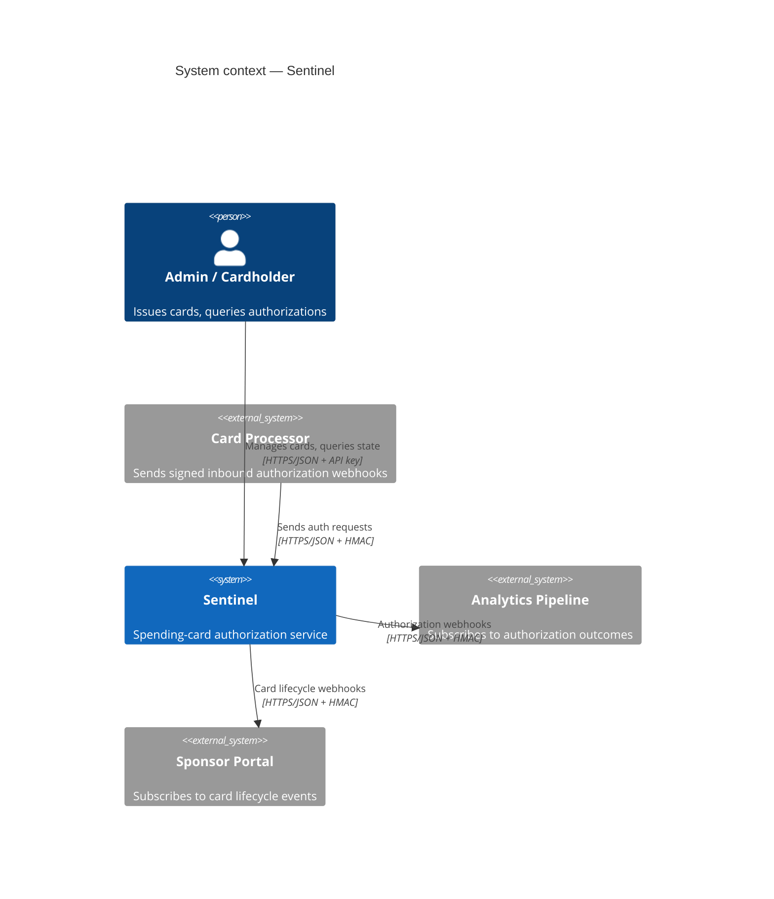
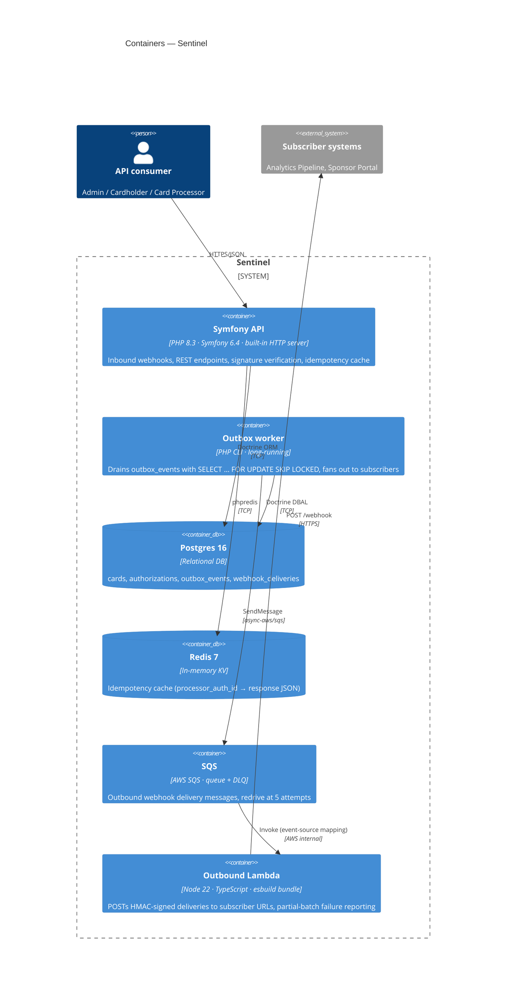
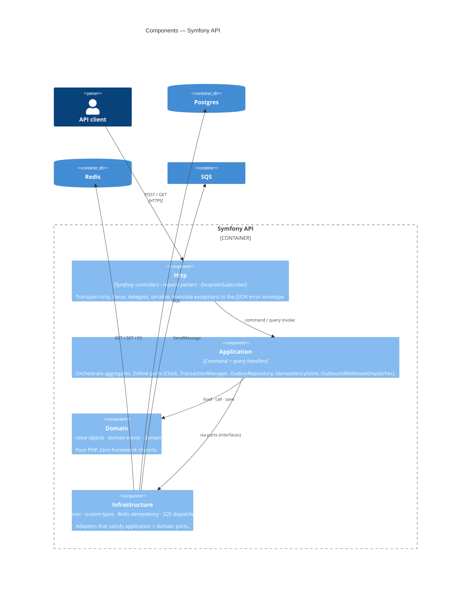
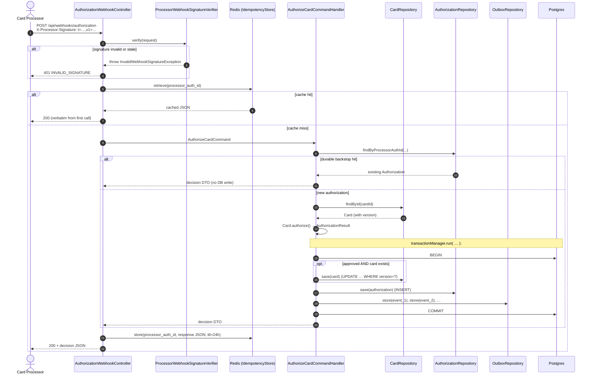
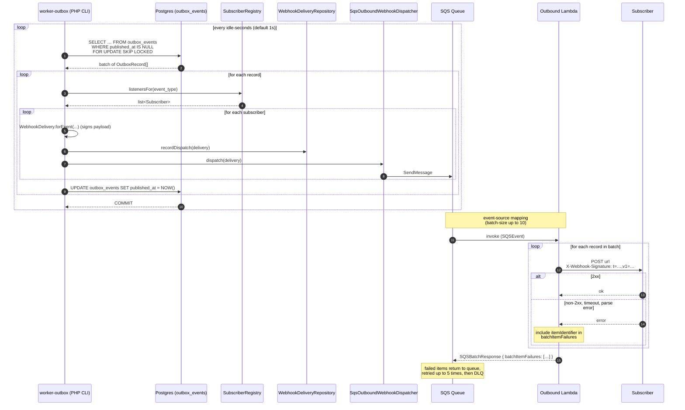

# Architecture

A walk-through of how Sentinel is structured, the choices that shaped
it, and the alternatives that were considered and rejected. Reviewers
who go deep should read this; what's here isn't covered in the README.

> **Diagram conventions**. Levels 1–3 of the [C4 model](https://c4model.com/)
> are rendered as Mermaid blocks (GitHub renders these inline). Flow
> sequences use `sequenceDiagram`. Level 4 — code structure — is
> already adequately conveyed by the project tree in the README; it
> isn't drawn here.

---

## Table of contents

1. [System context (C4 L1)](#1-system-context-c4-l1)
2. [Container view (C4 L2)](#2-container-view-c4-l2)
3. [Components inside the backend (C4 L3)](#3-components-inside-the-backend-c4-l3)
4. [The domain](#4-the-domain)
5. [Aggregates: Card and Authorization](#5-aggregates-card-and-authorization)
6. [Hexagonal architecture](#6-hexagonal-architecture)
7. [Inbound authorization flow](#7-inbound-authorization-flow)
8. [Outbound delivery flow](#8-outbound-delivery-flow)
9. [Async + reliability patterns](#9-async--reliability-patterns)
10. [Deliberate spec deviation — Lambda for outbound delivery](#10-deliberate-spec-deviation--lambda-for-outbound-delivery)
11. [Persistence choices](#11-persistence-choices)
12. [Testing strategy](#12-testing-strategy)
13. [What's intentionally missing for production](#13-whats-intentionally-missing-for-production)
14. [Trade-offs considered](#14-trade-offs-considered)

---

## 1. System context (C4 L1)



**Trust boundaries**. Sentinel never trusts an inbound HTTP request by
its mere arrival. There are three distinct trust regimes:

| Counterparty | Auth mechanism | Reason |
|---|---|---|
| Card processor | HMAC-SHA256 over `<timestamp>.<body>`, 5-min replay window | The processor isn't a user; it's a service. Pre-shared secret + signature is the lowest-coordination scheme that survives request capture. |
| Admin / cardholder | `X-API-Key` header, two virtual users (`admin` / `readonly`) | Sample-scale auth. Real deployment swaps `ApiKeyAuthenticator` for OAuth/OIDC without touching domain or application code. |
| Subscriber | We sign; they verify. Same HMAC scheme as inbound | Symmetric design: the contract Sentinel offers downstream is the one it asks of upstream. |

The system context fits on one page because Sentinel deliberately has
**no synchronous outbound dependencies on the authorization path**. The
200 ms inbound budget is enforceable because nothing on the hot path
calls anything across a network boundary except Postgres and Redis.

---

## 2. Container view (C4 L2)



### Why the outbox worker is a separate container, not a thread in the API

The API container is sized for request-bound latency (small, many
replicas, scale to zero possible). The worker is sized for steady
throughput (one or two replicas, long-lived, no scale-to-zero so the
queue doesn't grow). Putting the polling loop inside the API process
would force one operational model onto both workloads and create a
graceful-shutdown problem: a SIGTERM during a poll cycle would either
abort an in-flight batch or delay shutting down request handlers.

Both containers are built from the same Dockerfile target; only the
`command:` differs (`bin/console app:outbox:publish` vs. the built-in
HTTP server). The deploy artifact is shared; the runtime shape isn't.

### Why SQS lives inside the system boundary

C4 leaves "inside vs. outside" to the architect's judgment. SQS is an
AWS service, but Sentinel provisions it, owns its configuration
(visibility timeout, redrive policy, DLQ binding), and is the only
producer and the only indirect consumer. From the perspective of the
boundary question — *who can change this contract* — it's inside.

---

## 3. Components inside the backend (C4 L3)



### Dependency rule

Arrows point **inwards**: `Http → Application → Domain`, and
`Infrastructure → (Application ports + Domain interfaces)`. The Domain
layer has zero outward arrows. `grep -r "use Symfony" backend/src/Domain/`
returns nothing; the same goes for `use Doctrine` and `use AsyncAws`.
This is enforced by code review and by the obviousness of any
violation in the diff.

### Component responsibilities

| Component | What lives here | What does **not** live here |
|---|---|---|
| **Http** | Controllers (one per route, `__invoke`), `Request/*Parser` classes, `JsonReader`, `ApiKeyAuthenticator`, `ExceptionSubscriber` | Business decisions, transaction boundaries, repository access |
| **Application** | `AuthorizeCardCommandHandler` and siblings, view DTOs (`CardView`, `AuthorizationView`), port interfaces, `SubscriberRegistry` | Domain rules, framework integration |
| **Domain** | `Card`, `Authorization` aggregates; `Money`, `Currency`, `MerchantCategoryCode`, `GeoLocation` value objects; `CardIssued` and other events; `AggregateRoot`, `DomainEvent`, `Identifier`, `Uuid` primitives | DB shape, HTTP shape, anything dated `\DateTimeImmutable` *outside the aggregate boundary* (the application passes in `now`) |
| **Infrastructure** | `DoctrineCardRepository`, `DoctrineAuthorizationRepository`, `DoctrineOutboxRepository`, `RedisIdempotencyStore`, `SqsOutboundWebhookDispatcher`, `ProcessorWebhookSignatureVerifier`, custom Doctrine types | Orchestration logic — adapters are dumb |

---

## 4. The domain

The business domain is **simulated** patient-travel reimbursement
debit cards from clinical trials. The vocabulary that's modeled:

- **Card** — a virtual debit card with spending limits, an allowed
  merchant-category whitelist, and a lifecycle (Pending → Active →
  Suspended/Closed).
- **Authorization** — a recorded decision. Every inbound webhook
  produces exactly one (approval or decline, including for cards we
  don't recognize).
- **Merchant** — identity-less. The processor sends a name + MCC + an
  optional `GeoLocation`. Sentinel does not have a "merchant" table.
- **Money** — currency-aware integer amounts (cents). All arithmetic
  is integer; floating-point money is never permitted.
- **Spending limits** — per-transaction, daily, monthly. Daily and
  monthly counters roll over lazily.

**What's deliberately excluded:**

| Excluded | Why |
|---|---|
| Cardholder enrollment / KYC | Out of scope; assumes the cardholder exists upstream. |
| PCI scope / PAN storage | Sentinel handles tokenized identifiers only. |
| Authorization holds, captures, refunds, reversals (beyond the type) | Reversal exists as a type but isn't wired to a flow — the additional state machine isn't load-bearing for the patterns this codebase demonstrates. |
| Real card processor protocol (ISO 8583, Visa VAA, etc.) | The webhook shape is a simplification. The interesting work — signature verification, idempotency, latency budget — is identical. |
| Fraud detection, velocity rules, geo-rules | Listed in the spec as out of scope. |

---

## 5. Aggregates: Card and Authorization

Two aggregates, not one, not three.

### Why two and not one

`Card` and `Authorization` share data (`card_id`, `amount`) but they
disagree on every dimension that matters for aggregate design:

| Dimension | Card | Authorization |
|---|---|---|
| Mutability after creation | Mutates: lifecycle transitions, balance, daily/monthly counters | Immutable after `record()` (except `markReversed`) |
| Transactional invariant | "Don't decrement balance below zero", "don't change limits when closed" | "Each `processor_auth_id` produces exactly one Authorization" |
| Concurrency model | Optimistic locking on `version` | Insert-only; uniqueness enforced by index |
| Retention | Closed when the cardholder leaves the program | Outlives the card for audit/compliance |
| Domain events | Lifecycle events (`CardIssued`, `CardSuspended`, etc.) | Decision events (`CardAuthorizationApproved`, `Declined`) |

A combined `Card` aggregate that contained all its authorizations
would violate the "small aggregate" guidance: every authorization
would require loading every prior authorization for the same card,
and the transactional boundary would grow with history.

### Why not three (Cardholder)

`Cardholder` was considered as a separate aggregate. It was rejected
because nothing in the requirements references cardholder-level
invariants — there's no rule like "a cardholder may have at most N
cards" or "a cardholder's combined spend across cards must not
exceed Y". Without an invariant to defend, a `Cardholder` aggregate
would be an empty wrapper around an identifier.

`CardholderId` survives as a typed value object on the `Card`
aggregate. The strong-typed reference does the work; the missing
aggregate doesn't.

### How they communicate

`Card::authorize()` does not raise events. It returns an
`AuthorizationResult` — a pure value. The application service uses
that result to construct an `Authorization` aggregate, which is the
context that *can* raise `CardAuthorizationApproved` / `Declined`.

```
Card.authorize(amount, merchant, now)
  → AuthorizationResult  (pure value, no side effects)

Authorization::record(id, cardId, processorAuthId, …, result, …)
  → raises CardAuthorizationApproved | CardAuthorizationDeclined
```

This keeps the Card aggregate focused on *the decision* (a rules
engine) and pushes *the event about the decision* to the aggregate
that represents the decision record. Without this split, the Card
would need to know whether the application chose to persist the
authorization — which is exactly the kind of leakage the boundary
exists to prevent.

---

## 6. Hexagonal architecture

The dependency rule (Section 3) is the single most load-bearing
constraint in this codebase. Everything else flows from it.

### The ports

Domain ports (in `Domain/`):

| Port | Implementation | Why a port |
|---|---|---|
| `CardRepository` | `DoctrineCardRepository` | The aggregate needs to be loaded and saved; how is not its business |
| `AuthorizationRepository` | `DoctrineAuthorizationRepository` | Same |

Application ports (in `Application/`):

| Port | Implementation | Why a port |
|---|---|---|
| `Clock` | `SystemClock` (prod), `FixedClock` (tests) | Time is a dependency, not a primitive |
| `TransactionManager` | `DoctrineTransactionManager` (prod), `SynchronousTransactionManager` (tests) | The application defines the transaction boundary; Doctrine knows how to commit |
| `OutboxRepository` (write) + `OutboxReader` (read) | `DoctrineOutboxRepository` (both) | The handler and the worker want different shapes of the same data |
| `IdempotencyStore` | `RedisIdempotencyStore`, `InMemoryIdempotencyStore` (tests) | Redis is one choice; Memcached or DB-backed would be others |
| `OutboundWebhookDispatcher` | `SqsOutboundWebhookDispatcher`, `InMemoryOutboundWebhookDispatcher` (tests) | The Lambda deviation is contained behind this port |
| `WebhookDeliveryRepository` | `DoctrineWebhookDeliveryRepository` | Separate from outbox — different write cardinality |
| `CardQueryService`, `AuthorizationQueryService` | Doctrine DBAL implementations | Read-side bypasses the aggregate to avoid loading whole graphs for a list view |

### The cost of the discipline

It's worth being honest: hexagonal architecture isn't free. The price:

- More files. A simple "save this thing" becomes a port interface,
  an adapter, a service definition.
- Naming overhead. `DoctrineCardRepository` vs. `CardRepository`.
  Reviewers have to know which is which.
- Some interfaces have one implementation forever. `Clock` has
  exactly two (`SystemClock`, `FixedClock`) and that's plenty.

The price is worth paying when:

- The domain is non-trivial and worth protecting (it is here — rules
  engine, state machine, money math).
- Tests can be fast because the domain is testable in isolation
  (true: unit tests run in milliseconds because no kernel boots).
- Adapters are likely to change (probable here: real deployment
  swaps Postgres for RDS Aurora, Redis for ElastiCache, SQS for…
  still SQS, but with IAM auth).

The price is not worth paying for a CRUD service over a single table.
Sentinel is not that.

---

## 7. Inbound authorization flow



**What the diagram does and does not say.**

- The signature check is **first**. Verifying HMAC is cheap (a hash
  of the body); rejecting an unsigned request before anything else
  protects every subsequent layer.
- The idempotency check is **second**. A hit means the processor is
  retrying; the cached JSON is byte-identical to what the first call
  returned.
- The aggregate save and the outbox insert are in **one transaction**.
  This is the entire point of the outbox pattern: there is no window
  where an authorization is recorded but its event is lost (or
  vice-versa).
- The card row is only updated **if** the authorization was approved
  *and* the card existed. Declines and missing-card cases write an
  Authorization row only.
- `processor_auth_id` is the only natural key the processor controls,
  so it doubles as the durable idempotency backstop (UNIQUE
  constraint on the `authorizations` table).

---

## 8. Outbound delivery flow



**Why both `recordDispatch` and the SQS send live inside the same
transaction**. If SQS is unreachable, the whole batch rolls back and
the rows stay unpublished. The worker retries from a clean state on
the next tick. The opposite design — record-then-dispatch outside the
transaction — would leak rows whose dispatch failed silently.

**Why `FOR UPDATE SKIP LOCKED` and not a "claim" column**. Postgres
already provides exactly the locking semantics this needs. A claim
column (`worker_id`, `claimed_at`) would re-implement skip-locking in
application code, with all the staleness and orphan-recovery
problems that come with it. Skip-locked is a single-line solution
backed by the database.

---

## 9. Async + reliability patterns

### 9.1 Outbox pattern

**The problem it solves**: dual writes. Without the outbox, the
authorization flow would have to write to the database *and* publish
to SQS in the same logical step. There is no two-phase commit that
spans those two systems, so any failure between them leaves them
out of sync: an Authorization with no published event, or an event
published before the row was visible.

**The mechanics**:

1. Domain events accumulate on the aggregate via `AggregateRoot::raise()`.
2. After the aggregate is saved, the application service calls
   `releaseEvents()` and writes each one to `outbox_events` —
   inside the same DB transaction as the aggregate save.
3. A separate worker (different process, possibly different host)
   drains the table by selecting unpublished rows with
   `FOR UPDATE SKIP LOCKED`, dispatches each to its subscribers,
   and marks the row published.

**Alternatives that were considered**:

| Alternative | Why rejected |
|---|---|
| **Change Data Capture (CDC)** via Debezium or AWS DMS | Strictly better at scale, but adds Kafka or Kinesis to the topology, plus the operational cost of running CDC. Outbox pattern is a stepping stone; CDC is the upgrade path when the worker becomes a bottleneck or when other services want raw row changes. |
| **Event sourcing** | The domain isn't event-sourced (state lives in tables; events are notifications). Switching to event-sourcing would change everything about persistence for one downstream benefit; the cost/benefit doesn't pay off here. |
| **Two-phase commit (XA)** between DB and queue | SQS does not support XA. Even if it did, XA has well-known availability problems under partition. |
| **Publish first, then DB write** | Inverts the failure mode (orphan events). Worse than the orphan-row problem because subscribers act on phantom events. |
| **In-process Symfony Messenger with `doctrine://` transport** | This is the spec's default. It's effectively a degenerate outbox where the worker and writer share a transport. Sentinel does it explicitly with its own `outbox_events` table because (a) the event schema differs from Messenger's envelope, and (b) the Lambda deviation needs to dispatch to a non-Messenger consumer. |

### 9.2 Idempotency (two layers)

Two layers because they protect against different failure modes.

**Layer 1: Redis cache** (`processor_auth_id` → response JSON, 24h TTL).
The processor retries within seconds; Redis is microseconds. The fast
path matters for the 200 ms budget. A cache miss is acceptable
because Layer 2 catches it.

**Layer 2: DB unique constraint** (`UNIQUE (processor_auth_id)` on
`authorizations`). The durable backstop. Even if Redis is unavailable,
two parallel inserts of the same `processor_auth_id` produce one
authorization and one constraint-violation error that the application
service translates into "look it up and return the existing one".

**Why both, why not just the DB**:
- The DB is slow enough to threaten the 200 ms budget on the hot path.
- The DB enforces a constraint at COMMIT; Layer 1 lets the controller
  short-circuit *before* hitting the handler at all.

**Why both, why not just Redis**:
- Redis loses data on restart unless persistence is enabled.
- A 24h TTL means anything older has fallen out of the cache. The
  durable constraint catches the long-tail retry that arrives a week
  later.

**Cache key choice**. `processor_auth_id` is the only identifier the
processor controls and reuses across retries. An `Idempotency-Key`
header is honored if present; if absent, `processor_auth_id` is the
fallback. Using a server-generated key would defeat the purpose —
the processor wouldn't know what to send on retry.

### 9.3 Optimistic concurrency

The `Card` aggregate carries a `version` integer; Doctrine increments
it on UPDATE and enforces lost-update protection via the WHERE clause:

```sql
UPDATE cards
SET available_balance = ?, daily_spend = ?, monthly_spend = ?, …, version = version + 1
WHERE id = ? AND version = ?
```

If another transaction beat us to the COMMIT, this UPDATE affects
zero rows; Doctrine raises `OptimisticLockException`, and the
application layer can choose to retry or surface the conflict.

**Why optimistic, not pessimistic**:

| Approach | Latency cost | Correctness | Why rejected |
|---|---|---|---|
| `SELECT … FOR UPDATE` on every authorize | Held lock for the duration of the handler — incl. signature verify, idempotency check, etc. if naïvely positioned | Correct, but pessimistic | Throughput-killing under processor retry storms. The retry of the same card hits a held lock and queues. |
| `SERIALIZABLE` isolation | Engine-level retries on conflict | Correct | Engine retries are opaque; the application can't tell the processor "your retry succeeded" with a meaningful idempotency response. |
| Optimistic via `version` (chosen) | One UPDATE, one WHERE | Correct under conflict (transaction aborts; idempotency layer absorbs the retry) | — |

The interaction with idempotency is what makes optimistic work here:
under conflict, the second writer aborts, retries, and on the retry
sees the first writer's Authorization row via the unique constraint
or the Redis cache. There's no "what response do I give the
processor?" ambiguity.

### 9.4 Webhook signature verification

HMAC-SHA256 over `<timestamp>.<request-body>`, header format
`X-Processor-Signature: t=<unix>,v1=<hex>`, 5-minute tolerance
window.

**Why HMAC and not RSA / Ed25519**:

- The processor relationship is bilateral with a pre-shared secret;
  no PKI is needed.
- HMAC verification is microseconds; signature schemes are
  milliseconds. The hot path budget rewards the cheap option.
- Rotation is a coordinated secret-swap. Sentinel can be extended to
  accept two secrets during rotation (signing on send, accepting on
  receive) without changing the protocol.

**Why a timestamp + replay window** (and not just a nonce store):

- A nonce store needs a TTL of its own and a storage cost per
  request. A signed timestamp with a 5-min window achieves the same
  protection cheaper.
- The window is checked in both directions: the server rejects
  timestamps too far in the future *and* too far in the past. Clock
  skew is real; an unbounded future tolerance lets an attacker buy
  unlimited time.

**Why timing-safe compare**. `hash_equals()` instead of `===`. A
string-equality short-circuit on first mismatch leaks the matched
prefix via timing. The constant-time compare is the only
cryptographically correct choice.

### 9.5 Retry + dead-lettering (outbound)

SQS is the retry engine for outbound delivery. The Lambda's only job
is to attempt the POST; it does not retain state, does not implement
its own retry, does not exponential-back-off in-process.

**Failure semantics**:

| Lambda outcome | SQS interpretation |
|---|---|
| `batchItemFailures: []` | All records succeed; messages deleted |
| `batchItemFailures: [recordId, …]` | Listed records return to the queue; succeeded records are deleted |
| Lambda throws | Whole batch returns to the queue |
| Visibility timeout (60s) elapses without response | Whole batch returns to the queue |

Each return increments the message's receive count. After 5 returns,
SQS routes the message to the DLQ. The DLQ is unconsumed by default;
production operations would alarm on DLQ depth and provide a tool to
inspect, fix, and resubmit. (See §13.)

**Why per-batch retry and not per-message in-process retry inside
the Lambda**. Per-message in-process retry holds the Lambda compute
across attempts and inflates the maximum invocation time. SQS-level
retry is free, observable, and bounded by `maxReceiveCount`. A bad
batch with one stuck message wouldn't pin the Lambda for minutes.

---

## 10. Deliberate spec deviation — Lambda for outbound delivery

The spec (§10.5) describes outbound delivery as a Symfony Messenger
console worker. Sentinel runs it as an AWS Lambda function consuming
an SQS queue, emulated locally by
[floci](https://github.com/floci-io/floci).

**Scope**. Outbound only. Inbound stays a Symfony controller on the
200 ms budget. Lambda cold starts (~100–800 ms cold, ~5 ms warm) are
unpredictable enough to threaten that budget; running it as a regular
HTTP controller is the safer call.

**Why**. The user explicitly opted in to "expand the system
complexity" to demonstrate a multi-runtime, queue-driven architecture.
The cost is one additional language (TypeScript), one additional
container (floci), one additional deployable (`lambda/`). The
boundary is intentionally narrow so the deviation is contained.

**Async-pattern alternatives considered for the deviation**:

| Pattern | Why not |
|---|---|
| Direct Lambda invoke (no queue) | No retry; failure means the event is lost. Couples the producer to Lambda's availability. |
| EventBridge → Lambda | EventBridge is the right choice when fan-out is dynamic and consumers are heterogeneous. Here, the only consumer is one Lambda; SQS is the simpler match. |
| Kinesis / Kafka | Strictly more powerful (ordering, replay, multi-consumer) but operationally heavier than the scenario justifies. The "upgrade path" answer if requirements grow. |
| **SQS → Lambda (chosen)** | Built-in retry, built-in DLQ, partial-batch failure reporting, no consumer coordination. Matches the workload shape exactly. |

**How it works locally**:

1. `compose up` starts `lambda-builder` (one-shot Node container that
   bundles `lambda/src/index.ts` into `dist/handler.zip` via esbuild).
2. `floci` starts; `infra/init/setup.sh` runs on ready state, which
   creates the SQS queue + DLQ with redrive policy, deploys the
   Lambda zip, and wires the event-source mapping with
   `--function-response-types ReportBatchItemFailures`.
3. `worker-outbox` polls the outbox table and dispatches deliveries
   to SQS.
4. floci's event-source mapping invokes the Lambda with the SQS event.
5. The Lambda POSTs to the subscriber URL with the HMAC signature
   header.
6. `mock-receiver` (port 8888) captures the request for inspection.

**Why a shell init script and not Terraform**. For a sample of this
size, ~60 lines of `awslocal` calls are more transparent than the
equivalent Terraform module that emits the same AWS API calls. In a
real deployment the same resources are declared as Terraform / CDK
targeting real AWS — the `awslocal` calls map one-to-one to the SDK
calls IaC would generate.

---

## 11. Persistence choices

### Doctrine ORM 3, not DBAL-only

Doctrine ORM brings unit-of-work tracking, optimistic locking,
identity map, and lazy loading. For aggregates with rich behavior
(`Card` here), the identity map and version handling are valuable.
For read-side queries (list views, projections), Sentinel drops
straight to DBAL — `CardQueryService` and `AuthorizationQueryService`
issue hand-written SQL and hydrate to DTOs.

The split:

| Operation | Layer | Why |
|---|---|---|
| Load aggregate + behavior | ORM | Identity map + version + dirty checking earns its keep |
| Save aggregate | ORM | Version increment + optimistic UPDATE-with-WHERE |
| List authorizations for a card | DBAL → DTO | No need to load Authorization aggregates; the view doesn't call methods on them |
| Outbox `INSERT` / `UPDATE` | DBAL | `outbox_events` is not an aggregate; ORM mapping would be ceremony for no payoff |

### XML mapping, not attributes

The Domain layer must not import Doctrine. Attributes (`#[ORM\Entity]`)
would create that import.

XML mapping files live in
`Infrastructure/Persistence/Doctrine/Mapping/` under the
`SimplifiedXmlDriver` convention (filename mirrors the FQN as
`Card.Card.orm.xml`). Reviewers consistently report XML mapping as
the most uncomfortable trade-off of strict hexagonal style; it
remains the correct call when the alternative is leaking framework
imports into the domain.

### JSONB for `Merchant` and the MCC list

Two design options were on the table:

| Option | Pros | Cons | Chosen? |
|---|---|---|---|
| JSONB columns + custom Doctrine types | One row per authorization; merchants are write-once / read-rarely; queries are straightforward | Can't filter by `merchant.name` cheaply | ✅ |
| Embeddables (Doctrine `<embedded>`) | More structurally correct; query-friendly | Doctrine's nullable-embeddable story is awkward for optional `GeoLocation` | ❌ |
| Per-row child tables | Maximum normalization | Over-modeling for data that never gets queried independently | ❌ |

The JSONB choice is reinforced by the fact that `Merchant` is
identity-less. There's no `merchant_id` because there's no merchant
table.

### `async-aws/sqs`, not `aws/aws-sdk-php`

The full SDK is ~8× larger and includes 200+ AWS services Sentinel
doesn't use. `async-aws/sqs` is purpose-built for SQS and follows
modern PHP idioms (async resolution, typed responses). Endpoint URL
is configurable so dev/test points at `floci:4566` and production
targets real AWS without code changes.

---

## 12. Testing strategy

Three suites, each at a distinct level of the hexagon.

```
                                Functional
                              (HTTP boundary)
                                    △
                                   ╱ ╲
                                  ╱   ╲
                                 ╱     ╲     ← few; expensive
                                ╱       ╲
                       Integration       ╲
                  (real PG + Redis;       ╲
                   DAMA per-test          ╲
                   transaction)            ╲
                              △            ╲   ← some; moderate
                             ╱ ╲             ╲
                            ╱   ╲             ╲
                           ╱     ╲             ╲
                          ╱       ╲             ╲
                       Unit       (lots)         ╲
                  (pure domain                    ╲
                   + application                   ╲
                   with fakes)                     ╲
```

| Suite | What's tested | What's NOT tested |
|---|---|---|
| **Unit** (`tests/Unit/`) | Domain rules (every decline reason has a test). Value-object invariants. Application orchestration with in-memory fakes for every port (`FixedClock`, `SynchronousTransactionManager`, `InMemoryCardRepository`, etc.). | DB shape. HTTP shape. Anything that requires container boot. |
| **Integration** (`tests/Integration/`) | Adapter implementations against the real services. `DoctrineCardRepository` against Postgres, `RedisIdempotencyStore` against Redis, `DoctrineOutboxRepository`'s `FOR UPDATE SKIP LOCKED` behavior. Each test runs inside a DAMA-managed transaction that rolls back, so they stay independent. | Business logic — that's already tested in Unit. |
| **Functional** (`tests/Functional/`) | HTTP round-trips through the kernel. Auth, signature verification, idempotency cache hit/miss, the full authorization controller chain, role-based access control. | Internals — these are end-to-end. |

**Coverage philosophy**. Unit tests are cheap; write many. Functional
tests are expensive; write enough to prove the wiring works.
Integration tests are the in-between: write one when an adapter has
behavior of its own (the outbox's skip-locked query) and skip them
when the adapter is a pass-through.

**Why DAMA over manual rollback**. DAMA's `doctrine-test-bundle`
wraps each test in a transaction that rolls back on tearDown. The
alternative — truncating tables — is slower and harder to keep
correct across many tests. DAMA's only cost is awareness: any test
that needs *committed* state (rare) has to opt out.

---

## 13. What's intentionally missing for production

A non-exhaustive list. The point of being explicit is that
"production-ready" is a meaningful distinction; reviewers should
not have to guess what was deferred vs. what was overlooked.

- **Lambda → backend feedback loop**. The `webhook_deliveries.status`
  field captures only the dispatch event. A real system would have
  the Lambda update the row on completion — direct Postgres access
  via RDS Proxy, or a "delivery completed" event posted back through
  EventBridge / a second SQS queue. Without this, the admin replay
  endpoints can't accurately distinguish "in flight" from
  "permanently failed".
- **Admin replay endpoints**.
  `POST /api/admin/webhook-deliveries/{id}/replay` and
  `GET /api/admin/webhook-deliveries?status=failed`. Listed in the
  spec as "if time permits"; deferred. They're cheap to add but
  meaningful only after the feedback loop above lands.
- **Real subscriber configuration**. Subscribers come from a static
  `config/packages/subscribers.yaml`. Production would manage them
  in a database with an admin UI, per-subscriber rate limits,
  back-off policies, and the ability to disable a misbehaving
  subscriber without a deploy.
- **HIPAA / PHI**. The service is HIPAA-aware in shape (audit
  logging, encrypted-at-rest assumptions) but stores no real PHI. A
  production deployment would add encryption-in-transit between
  every hop, KMS key management, application-role separation from
  audit-log destinations, and access auditing.
- **Multi-region + failover**. Single-region Postgres + Redis +
  floci/SQS for the sample. Production would need multi-AZ Postgres
  with read replicas, Redis with cluster mode, cross-region SQS
  replication for the outbound queue.
- **Observability**. CloudWatch / OpenTelemetry instrumentation:
  Lambda invoke failures, throttles, DLQ depth, outbox lag (oldest
  unpublished `occurred_at`), inbound P95/P99 latency, Redis hit
  rate. None of this exists locally.
- **Real IaC**. Terraform / CDK pointed at AWS, with a CI pipeline
  that packages and deploys the Lambda independently of the backend.
- **Authorization expiry**. An approved authorization should
  eventually expire if not captured. The Authorization aggregate
  has a `markReversed` capability but no scheduled expiry. Most
  card processors expire holds at 7 days.
- **Rate limiting on the inbound webhook**. A processor
  misbehaving could hammer Sentinel. Production would apply a token-bucket
  per processor identity (in Redis), with the limit configurable.

---

## 14. Trade-offs considered

Choices that could have gone the other way, listed with the
reasoning that tipped them.

### `MerchantId` deliberately omitted

Spec §4.2 lists `MerchantId` as an identifier value object, but no
aggregate references it — `Merchant` is modeled as an identity-less
value object on the Authorization aggregate. Adding an unused
identifier class is exactly the cruft §17.1 warns against; the
principle beat the literal listing.

### JSONB columns vs. embeddables vs. child tables

Covered in §11. Repeated here because reviewers ask: chosen for
write-once / read-rarely access patterns and Doctrine's awkward
nullable-embeddable behavior with optional `GeoLocation`.

### `async-aws/sqs` vs. `aws/aws-sdk-php`

The slim SDK is ~8× smaller and idiomatic; we only use SQS so the
full SDK's breadth isn't earning its weight.

### `Card::authorize()` does **not** raise events

Only the calling context (the command handler) does, by constructing
an `Authorization` aggregate that raises
`CardAuthorizationApproved` / `Declined`. The Card stays focused on
the decision (a pure rules engine); the cross-aggregate event lives
on the aggregate that represents the decision record. Without this
split, the Card would couple to the existence of the Authorization.

### Manual `++$this->version` removed from `Card`

Doctrine's optimistic-lock handling increments the version field
automatically on UPDATE; the manual bump conflicted with it and
raised `OptimisticLockException` on every approved authorization
flush. Optimistic concurrency is still enforced — by the
`WHERE version = ?` clause Doctrine adds on commit.

### XML mapping, not attributes

Domain purity (no Doctrine imports) was the deciding factor; the
XML-vs-attributes split is the only place where the hexagonal rule
visibly costs ergonomics. Reviewers who view this as overzealous
have a point; reviewers who value the domain-layer-zero-imports
guarantee accept the trade.

### Two virtual users, not a full IdP

`ApiKeyAuthenticator` resolves `admin` and `readonly` from env vars.
This is sample-scale; the role hierarchy (`ROLE_ADMIN > ROLE_READONLY`)
and access control list in `security.yaml` are production-shape.
Swapping the authenticator for OAuth/OIDC is a one-class change
because nothing downstream of `Symfony\Security` depends on the
auth mechanism.

### One commit per phase, not feature branches

The repo was built in eight commits aligned to the spec's §16 build
order. The history is meant to be reviewable as a narrative — each
commit is a self-contained, working state of the codebase at its
stated level of capability. The alternative — a single squashed
commit — would erase the chronology of decisions that
`git blame --reverse` rewards.
